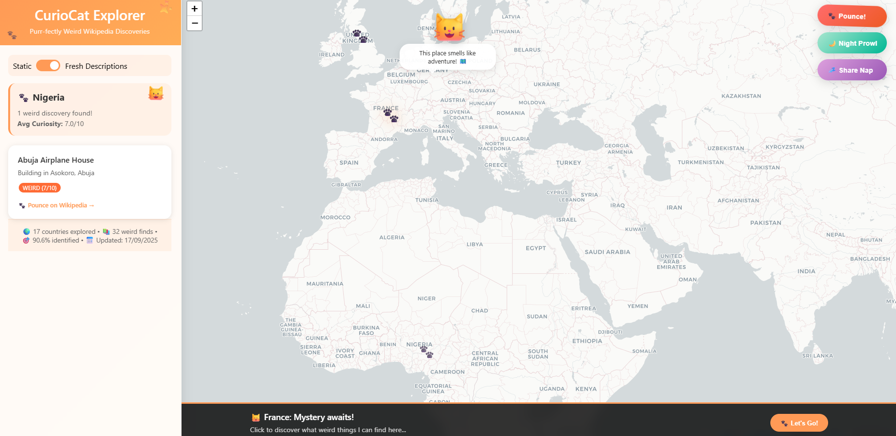

# 🌍 CuriousCat

CuriousCat is a lightweight web app that visualizes **unusual Wikipedia articles** on an interactive world map.  
Beyond being fun and quirky, this project is also a **data engineering exercise** in scraping, enriching, and visualizing semi-structured data from public APIs.

---

## View Demo!

  

## 📖 Project Walkthrough

### 1. What is CuriousCat?
CuriousCat blends data engineering and visualization:  
- Pull unusual Wikipedia articles via the Wikipedia API  
- Enrich and structure the data (title, description, URL, thumbnail, region, country)  
- Serve the results in an interactive map for exploration  

It demonstrates the value of turning **raw, unstructured data** into an experience that is usable, engaging, and insightful.  

---

### 2. Data Source

- **Primary Source**: [Wikipedia: Unusual articles](https://en.wikipedia.org/wiki/Wikipedia:Unusual_articles)  
- **Extraction**: Wikipedia API for article metadata  
  - Title  
  - Description  
  - URL  
  - Thumbnail  
- **Enrichment**: Added fields for **country** and **region** to enable geographic visualization  
- **Storage**: Lightweight JSON dataset  

---

### 3. Methodology

1. **Data Collection**  
   - Scrape Wikipedia’s “Unusual Articles” list.  
   - Fetch metadata via the Wikipedia API (article summaries, thumbnails, links).  

2. **Data Transformation & Enrichment**  
   - Normalize article structure into a consistent schema.  
   - Map countries to regions (e.g., Asia, Europe, Latin America, etc.).  
   - Handle missing values and inconsistencies from the API.  

3. **Visualization**  
   - Use **Leaflet.js** or **Mapbox** to create an interactive world map.  
   - Country-level mapping with popups for article details.  
   - Clean UI with playful, curiosity-driven design.  

---

### 4. Technical Stack

| Component     | Choice                                 |
| ------------- | -------------------------------------- |
| Frontend      | Vanilla CSS + JavaScript               |
| Map Library   | Leaflet.js (lightweight) or Mapbox     |
| Backend       | Flask                                  |
| Data Source   | Wikipedia API                          |

---

## 🔑 Key Takeaways and Learnings

- **Data Modeling Matters**  
  Defining a schema (title, description, URL, thumbnail, country, region) early kept the pipeline structured and easier to extend.  

- **CuriousCat shows how data engineering + visualization = storytelling.** 
  It bridges geography with curiosity to provide a fun way to explore the world through unusual knowledge.    

- **Direct Wikipedia integration**
  Ensures accurate, up-to-date information.  

---